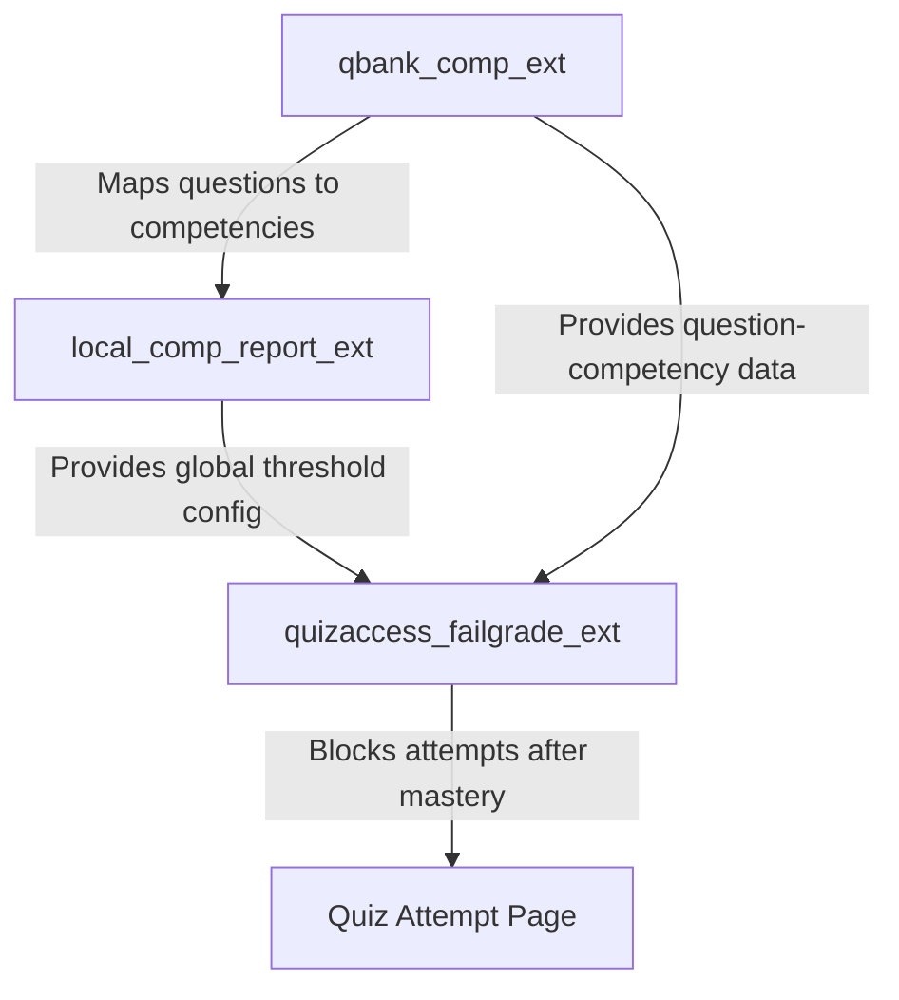

# 🛑 Moodle Quiz Access Rule: Fail Grade (`quizaccess_failgrade_ext`)

[](https://moodle.org)
[](https://php.net)
[](https://docs.moodle.org)
[](http://www.gnu.org/copyleft/gpl.html)
[](https://github.com/engfeda-ui/failgrade)

An essential Moodle quiz access rule plugin designed to enforce mastery-based learning. This plugin prevents students from starting new quiz attempts once they have proven their competency, encouraging them to focus on other areas once mastery is achieved.

It supports dual-mode locking: traditional **Grade-Based** locking and a highly customisable **Competency-Based** locking mode.

---

## ✨ Features

- **Dual-Mode Mastery Locking:**
  - **Grade-Based Mode:** Restricts students from making additional attempts once they reach or exceed the quiz's **"Grade to pass"**.
  - **Competency-Based Mode:** Prevents students from starting new attempts once they achieve mastery in all Moodle competencies mapped to the quiz via `qbank_comp_ext`.
- **Custom Per-Quiz Competency Threshold:** Configure a custom passing percentage (e.g., `60%`) per quiz. If set to `0`, falls back to the global `success_threshold` defined in `local_comp_report_ext` settings.
- **Real-Time Competency Progress Table:** Renders a responsive Bootstrap table on the quiz landing page showing each mapped competency, the required threshold, the student's current score, and a colour-coded status badge (**Passed** / **Needs Improvement**).
- **Moodle Event Logging:** Fires a `attempt_blocked_by_failgrade` event when a student is blocked, providing a full audit trail in Moodle's log store.
- **Privacy Subsystem (GDPR):** Full compliance with Moodle's privacy API.
- **Backup & Restore:** Integrates with Moodle's core course backup/restore pipeline.
- **PHPUnit Test Coverage:** Standardised tests for attempt locking logic.

---

## 📋 Requirements

| Dependency | Required Version / Compatibility |
| :--- | :--- |
| **Moodle Framework** | Moodle 4.0 to 5.0+ |
| **PHP Runtime** | PHP 8.1, PHP 8.2, PHP 8.3 |
| **Database System** | PostgreSQL 13+, MySQL 8.0+, or MariaDB 10.5+ |
| **Required Plugin** | [**`qbank_comp_ext`**](https://github.com/engfeda-ui/competency) ≥ 2026052500 (for competency mode) |

---

## 🚀 Installation

1. **Prerequisite (for competency mode):** Install [**`qbank_comp_ext`**](https://github.com/engfeda-ui/competency) first.
2. **Download & Extract:** Download the repository and extract the files.
3. **Directory Placement:** Copy the `failgrade` folder into your Moodle quiz access rules directory:
   ```
   moodle/mod/quiz/accessrule/failgrade_ext
   ```
4. **Run Moodle Upgrade:** Log in as Administrator and navigate to **Site administration > Notifications**.
5. **Alternative Install:** Zip the directory and upload via **Site administration > Plugins > Install plugins**.

---

## 🛠️ Usage & Configuration

### A. Grade-Based Mode
1. Open a **Quiz** and go to **Quiz Settings > Grade**:
   - Set **Attempts allowed** to more than 1.
   - Set a **Grade to pass** value (e.g., `8.00`).
2. Expand **Extra restrictions on attempts**:
   - Set **"Block extra attempts if passing grade"** → **"Yes (Rely on passing grade)"**.
3. Save. Students are blocked from new attempts once they reach the passing grade.

### B. Competency-Based Mode
1. Open a **Quiz** and expand **Extra restrictions on attempts**:
   - Set **"Block extra attempts if passing grade"** → **"Yes (Rely on competencies)"**.
   - A **"Competency success threshold (%)"** field appears. Enter a value (e.g., `60`) or leave at `0` to use the global threshold from `local_comp_report_ext` settings.
2. Map competencies to this quiz's questions using `qbank_comp_ext`.
3. Students can attempt the quiz freely until they achieve the required percentage across all mapped competencies. Once mastered, the attempt button is blocked and a success message is shown.

> **Global threshold:** Configure the default threshold at **Site administration > Plugins > Local plugins > Competency Plugin > Success threshold**.

---

## 📋 Changelog

### v2.4.3 (2026082400) — 2026-08-24
- **Maintenance:** Added standard `.gitignore` and `.gitattributes` for repository hygiene and unified LF line endings.
- **Security:** Excluded local agent instruction files from git tracking.
- **CI/CD:** Enhanced dual-environment deployment workflow with flexible staging host configuration.

### v2.4.2 (2026072702) — 2026-07-27
- **PHPUnit Test Fix:** Updated `get_user_competencies_rates()` in `rule.php` to detect when a unit test mock or subclass overrides `get_user_competency_rate()` via reflection, passing `test_competency_mode_all_achieved`.

### v2.4.1 (2026072701) — 2026-07-27
- **CodeSniffer Compliance:** Resolved PHPCS Moodle CodeSniffer errors in `rule.php` by replacing long `list()` syntax with short array destructuring `[...]` syntax.

### v2.4.0 (2026072700) — 2026-07-27
- **Performance Fix:** Resolved N+1 DB query loops in `rule.php` by implementing `get_user_competencies_rates()` and bulk pre-fetching competency shortnames outside loops.
- **Packaging:** Standardized ZIP package directory structure to `failgrade_ext/` using standard forward slashes (`/`) for Moodle Directory validation.
- **Repository Naming Note:** Recommended official repository naming convention is `moodle-quizaccess_failgrade_ext`.

### v2.3.1 — 2026-07-25
- **Fix:** Fixed missing database table `mdl_quizaccess_failgrade_ext` for Quiz Access Rule.

### v2.3.0 — 2026-07-24
- **Release:** Standardized frankenstyle component name to `quizaccess_failgrade_ext` installed under `mod/quiz/accessrule/failgrade_ext`. Updated dependency requirement to `qbank_comp_ext` >= `2026070500`.

### v2.2.1 — 2026-07-05
- **Fix:** Corrected line length formatting and spacing issues to comply with Moodle CodeSniffer standards (PSR12, maximum line length).
- **Fix:** Added missing DocBlock comments for `get_user_competency_rate()` inside `rule.php` to prevent PHPUnit / CI errors.

### v2.2.0 — 2026-05-25
- **New:** Combined Locking Mode (Mode 3) — teachers can now restrict student quiz attempts based on achieving BOTH the passing grade AND mastering all mapped competencies.
- **New:** High-Fidelity Interactive Progress Dashboard — replaced the basic competency text layout on the quiz page with beautiful Boost-compatible Bootstrap progress bars (green, orange, red) and dynamic FontAwesome status badges.
- **Dependency Sync:** Updated `qbank_comp_ext` dependency to `2026052500` for ecosystem compatibility.

### v2.1.2 — 2026-05-19
- **New:** `qbank_comp_ext` formally declared as a plugin dependency in `version.php`. Moodle will now refuse to install `quizaccess_failgrade_ext` if `qbank_comp_ext` is not present.
- **Refactor:** Extracted `extract_competency_id($cmcomp)` as a protected helper method in `rule.php`. The ~30-line competency ID extraction block was previously duplicated three times across `description()` and `is_finished()` — now centralised in one place.

### v2.1.1 — 2026-05-15
- Added `competencythreshold` field to the database schema via upgrade script.
- Added per-quiz competency threshold setting to the quiz settings form.

### v2.1.0 — 2026-05-15
- Competency-based mode (mode 2) introduced.
- Real-time competency progress table on the quiz view page.
- `attempt_blocked_by_failgrade` Moodle event for audit logging.

### v2.0.0 — 2026-05-15
- Three-mode selector: Disabled / Grade-based / Competency-based.

### v1.x
- Original grade-based locking (based on work by Alexandre Paes Rigão).

---

## 💻 Directory Structure

```
failgrade/
├── classes/
│   ├── event/
│   │   └── attempt_blocked_by_failgrade.php  # Moodle event class
│   └── privacy/
│       └── provider.php                      # GDPR Privacy provider
├── db/
│   ├── install.xml     # Database schema
│   └── upgrade.php     # Upgrade steps
├── lang/
│   └── en/             # English language strings
├── tests/              # PHPUnit test suites
├── .github/            # GitHub Actions CI workflows
├── rule.php            # Main access rule class
├── version.php         # Plugin version and metadata
└── README.md
```

---

## 🔗 The Competency Ecosystem



---

## 🧪 Development & Testing

```bash
# Initialise PHPUnit environment
php admin/tool/phpunit/cli/init.php

# Run tests for this plugin
vendor/bin/phpunit --group quizaccess_failgrade_ext
```

---

## 🔒 Security & Code Compliance

- **SQL Injection Prevention:** All queries use Moodle's `$DB` API with named parameter bindings.
- **Input Sanitization:** All input retrieved via `required_param()` / `optional_param()` with strict type filters.
- **Capability Controls:** Access points enforce `require_login()` and `require_capability()`.
- **Namespace Compliance:** Event and privacy classes under `\quizaccess_failgrade_ext\` namespace.
- **Coding Standards:** Compliant with Moodle's `PHP_CodeSniffer` (PHPCS) ruleset.

---

## 📄 License & Credits

- **Copyright:** © 2026 Mahmoud Salem
- **Based on work by:** 2020 Alexandre Paes Rigão
- **License:** [GNU GPL v3](http://www.gnu.org/copyleft/gpl.html) or later.
